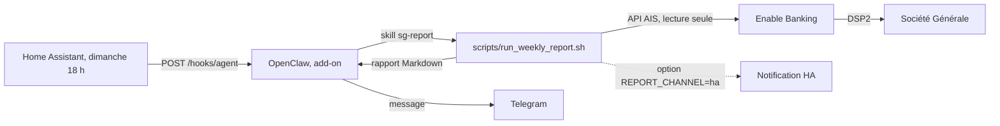

# Rapport hebdo Société Générale pour OpenClaw

Un bot qui lit vos comptes Société Générale **en lecture seule**, via l'Open Banking (DSP2), et vous envoie chaque dimanche sur Telegram un rapport de vos dépenses : soldes, dépenses par catégorie, top commerçants, comparaison avec la semaine précédente et points d'attention. Il s'installe dans l'add-on **OpenClaw** de Home Assistant, qui envoie le message via votre bot Telegram déjà configuré. Home Assistant sert de planificateur et peut aussi afficher le rapport en notification.

Aucune dépendance à installer : le code n'utilise que la bibliothèque standard de Python 3.11, disponible dans l'add-on OpenClaw. Chargement du skill et webhook testés avec OpenClaw 2026.9.6.

```text
**Rapport hebdo Société Générale (démo)**
Du 23 au 29 septembre 2026

**Soldes**
- Compte courant (…5821) : 2 831,52 € (à venir 2 778,02 € · semaine : +2 532,31 €)
- Livret A (…7734) : 8 200,00 € (semaine : 0,00 €)

**Bilan de la semaine**
- Dépenses : 317,69 € (+19 % vs semaine préc.)
- Revenus : 2 850,00 €
- Revenus − dépenses : +2 532,31 €

**Dépenses par catégorie**
- Transport : 166,89 € (53 %, 0,00 € la semaine préc.)
- Courses : 93,18 € (29 %, -13 % vs semaine préc.)
- Restaurants & sorties : 49,11 € (15 %, +38 % vs semaine préc.)
- Santé : 8,51 € (3 %, -84 % vs semaine préc., net de 24,69 € remboursés)

**Top commerçants**
1. SNCF Internet : 151,84 € (2 achats)
2. Big Mamma : 45,07 € (1 achat)
...

**Points d'attention**
- Transport en hausse : 166,89 € contre 0,00 € la semaine précédente (+166,89 €).

_12 opérations analysées, dont 2 en attente._
```

## Comment ça marche



**Pourquoi Enable Banking ?** L'API de la Société Générale est déjà une API Open Banking (DSP2), mais seuls les prestataires agréés (AISP), équipés de certificats eIDAS, ont le droit de l'appeler. [Enable Banking](https://enablebanking.com) est l'un de ces prestataires. Son « mode restreint », réservé à vos propres comptes, est gratuit pour un usage personnel non commercial. Vous validez l'accès une fois dans l'Appli SG ; votre mot de passe bancaire n'est jamais stocké ni transmis au bot.

## Essai immédiat, sans banque

```sh
git clone <url-de-votre-dépôt> sg-report && cd sg-report
scripts/setup.sh
scripts/sg-report --mock run
```

Le mode démo (`--mock` ou `SG_REPORT_MOCK=1`) génère des opérations fictives au format Société Générale et range ses données dans `data/demo/`.

## Installation sur Home Assistant

### 1. Récupérer le projet dans l'add-on OpenClaw

Dans le terminal de l'add-on (page de l'add-on OpenClaw Assistant dans Home Assistant) :

```sh
cd /config
git clone <url-de-votre-dépôt> sg-report
sg-report/scripts/setup.sh
```

`/config` est le dossier persistant de l'add-on : le projet, sa configuration et ses données survivent aux mises à jour et sont inclus dans les sauvegardes Home Assistant.

### 2. Créer l'application Enable Banking

1. Créez un compte sur [enablebanking.com](https://enablebanking.com) (connexion par lien envoyé par e-mail).
2. Dans le [Control Panel](https://enablebanking.com/cp/applications), créez une application :
   - **Environment** : `Production` (`Sandbox` pour des données de test) ;
   - **Private key** : gardez « Generate in the browser (using SubtleCrypto) and export private key » ; un fichier `.pem` est téléchargé à l'enregistrement, c'est votre clé privée ;
   - **Allowed redirect URLs** : `https://localhost/sg-report/callback` ;
   - description, e-mail RGPD, URL de politique de confidentialité et de CGU : obligatoires en production ; pour un usage personnel, votre e-mail et l'URL de votre dépôt suffisent.
3. Notez l'**Application ID** (un UUID).
4. Cliquez sur **Activate by linking accounts**, choisissez Société Générale et validez dans l'Appli SG. L'application passe en mode restreint : seuls les comptes reliés ici seront accessibles.
5. Copiez le fichier `.pem` dans l'add-on, par exemple via l'add-on Samba ou File editor (dossier `addon_configs/…openclaw…`), vers `/config/sg-report/keys/enablebanking.pem`, puis :

   ```sh
   chmod 600 /config/sg-report/keys/enablebanking.pem
   ```

### 3. Renseigner `.env`

```sh
nano /config/sg-report/.env
```

Indiquez au minimum `ENABLE_BANKING_APP_ID`. Les autres valeurs par défaut conviennent à un compte particulier Société Générale. Vérifiez le nom exact de la banque chez Enable Banking :

```sh
/config/sg-report/scripts/sg-report aspsps --search generale
```

### 4. Donner l'accès aux comptes (consentement DSP2)

Cette autorisation s'ajoute à celle de l'étape 2.4 : Enable Banking demande les deux, même pour les mêmes comptes.

```sh
cd /config/sg-report
scripts/sg-report link
```

Ouvrez le lien affiché, validez dans l'Appli SG. Vous arrivez ensuite sur `https://localhost/sg-report/callback?...` : la page ne s'affiche pas, c'est normal. Copiez son adresse complète, puis :

```sh
scripts/sg-report link --callback-url "https://localhost/sg-report/callback?state=...&code=..."
scripts/sg-report run
```

Le consentement dure jusqu'à 180 jours (selon la banque). Le rapport prévient 14 jours avant l'échéance ; il suffit alors de refaire cette étape, ou de demander à OpenClaw sur Telegram de « renouveler l'accès SG ».

### 5. Déclarer le skill et le webhook dans OpenClaw

Fusionnez le contenu de [`openclaw/openclaw.example.json5`](openclaw/openclaw.example.json5) dans `/config/.openclaw/openclaw.json` :

- `skills.load.extraDirs` fait découvrir le skill [`skills/sg-report`](skills/sg-report/SKILL.md) ;
- `hooks` active le webhook appelé par Home Assistant. Générez le jeton avec `openssl rand -hex 32` ; il doit être différent de `gateway.auth.token`.

Autorisez ensuite l'agent à lancer les scripts du projet sans validation manuelle (indispensable pour l'envoi automatique du dimanche), puis redémarrez l'add-on :

```sh
openclaw approvals allowlist add --agent main "/config/sg-report/scripts/*"
```

Vérifiez que le skill est chargé : `openclaw skills info sg-report` doit afficher « Ready ». Testez ensuite depuis Telegram : envoyez `/sg-report` à votre bot OpenClaw, ou demandez « fais-moi le rapport SG ». Vous pouvez aussi lui poser des questions (« combien en restaurants ce mois-ci ? »).

### 6. Automatisation Home Assistant, chaque dimanche à 18 h

1. Copiez [`homeassistant/packages/sg_report.yaml`](homeassistant/packages/sg_report.yaml) dans `/config/packages/` de Home Assistant et activez les packages dans `configuration.yaml` :

   ```yaml
   homeassistant:
     packages: !include_dir_named packages
   ```

2. Ajoutez les deux entrées de [`homeassistant/secrets.example.yaml`](homeassistant/secrets.example.yaml) à `/config/secrets.yaml` :
   - `openclaw_hooks_authorization` : `Bearer ` suivi du jeton `hooks.token` ;
   - `sg_report_telegram_chat_id` : votre identifiant Telegram numérique (par exemple via le bot `@userinfobot`). Pour une conversation privée avec le bot OpenClaw, c'est aussi l'identifiant de la conversation.
3. Redémarrez Home Assistant et lancez le script **Rapport SG maintenant** pour tester.

Le package contient un `rest_command` vers `http://127.0.0.1:18789/hooks/agent`, le script de test et l'automatisation du dimanche. Si OpenClaw refuse la demande, une notification persistante l'indique. Un `shell_command` ne conviendrait pas : il s'exécute dans le conteneur de Home Assistant, qui ne voit pas les fichiers de l'add-on OpenClaw.

## Recevoir aussi une notification Home Assistant

Dans `.env` :

```sh
REPORT_CHANNEL=ha
HA_NOTIFY_SERVICE=persistent_notification.create   # rapport complet, en Markdown
HA_PUSH_SERVICE=notify.mobile_app_mon_telephone    # résumé court en push (optionnel)
```

Le script a besoin d'un jeton Home Assistant longue durée : renseignez l'option `homeassistant_token` de l'add-on OpenClaw (enregistrée dans `/config/secrets/homeassistant.token`, lue automatiquement) ou `HA_TOKEN` dans `.env`. Pour ne recevoir que la notification, sans le message Telegram, mettez `"deliver": false` dans le `rest_command`.

## Commandes

Toutes les commandes s'utilisent via `scripts/sg-report` (ou `python3 -m sg_report` depuis la racine du dépôt). Ajoutez `--mock` pour les données de démonstration.

| Commande | Rôle |
| --- | --- |
| `run` | Rapport hebdomadaire : synchronise 14 jours, affiche le rapport et notifie Home Assistant si `REPORT_CHANNEL=ha` |
| `report` | Rapport depuis les données locales : `--days`, `--end AAAA-MM-JJ`, `--format markdown\|json\|summary`, `--fetch` |
| `fetch` | Synchronise soldes et opérations (`--days`, 89 au maximum) |
| `link` | Démarre le consentement, puis le termine avec `--callback-url` |
| `status` | Validité de l'accès, comptes, dernière synchronisation |
| `aspsps` | Liste les banques disponibles chez Enable Banking (`--search`) |

En cas d'erreur, le code de sortie vaut 2 pour la configuration ou un accès à renouveler, 3 pour une banque indisponible et 4 pour une notification refusée.

## Catégories

Les opérations sont classées par mots-clés adaptés aux libellés Société Générale (`CARTE X1234 21/09 …`, `PRLV SEPA …`, `VIR RECU … DE: …`) : Courses, Restaurants & sorties, Transport, Logement, Énergie & télécom, Abonnements, Shopping, Santé, Assurances, Banque & frais, Retraits d'espèces, Impôts & administration, Loisirs & voyages, Salaire, Aides & allocations.

- Les virements entre vos comptes et vers l'épargne sont exclus des dépenses et apparaissent en « Mis de côté ».
- Un remboursement (CPAM, ami qui vous rembourse un resto, avoir) vient en déduction de la catégorie concernée.
- Les hausses et le top commerçants ne portent que sur les dépenses variables. Le loyer, l'énergie et les abonnements tombent à date fixe et fausseraient la comparaison d'une semaine à l'autre.

Pour ajouter vos propres règles, copiez [`categories.example.json`](categories.example.json) en `categories.json` : elles passent avant celles par défaut.

## Sécurité et confidentialité

- Accès en **lecture seule** (service AIS de la DSP2) : ni virement ni paiement possible.
- Aucun identifiant bancaire n'est stocké : l'authentification se fait dans l'Appli SG.
- Enable Banking, prestataire agréé, voit transiter les données. Elles sont ensuite stockées en clair dans `data/`, avec des droits `0600`, sur le disque de votre Home Assistant, et incluses dans ses sauvegardes.
- `.env`, `keys/`, `data/` et `categories.json` sont exclus de Git.
- La DSP2 limite à 4 par jour les accès faits sans votre intervention : le rapport hebdomadaire n'en utilise qu'un.

## Dépannage

| Symptôme | Piste |
| --- | --- |
| `NO_ACCOUNTS_ADDED` | Reliez vos comptes à l'application dans le Control Panel (« Activate by linking accounts »). |
| `REDIRECT_URI_NOT_ALLOWED` | `ENABLE_BANKING_REDIRECT_URL` doit être déclarée à l'identique dans l'application. |
| Banque introuvable | `scripts/sg-report aspsps --search generale`, puis corrigez `ENABLE_BANKING_ASPSP_NAME`. |
| Rien n'arrive sur Telegram | Notification persistante dans HA ? Sinon, journal de l'add-on OpenClaw (ligne `hook agent run completed`) : jeton `hooks`, `agentId`, identifiant Telegram. |
| `channel must be last` (HTTP 400) | Aucun canal Telegram n'est configuré dans OpenClaw (`channels.telegram`). |
| L'agent demande une validation | Ajoutez l'allowlist de l'étape 5. |
| « Historique local incomplet » | La période demandée dépasse les données synchronisées : relancez avec `--fetch`. |

## Développement

```sh
uv venv && uv pip install -e ".[dev]"   # ou : python3 -m venv .venv && .venv/bin/pip install -e ".[dev]"
.venv/bin/pytest
.venv/bin/ruff check . && .venv/bin/ruff format --check .
```

| Dossier | Contenu |
| --- | --- |
| `sg_report/` | CLI, client Enable Banking (`clients/`), catégorisation, rapport, stockage, notification HA |
| `skills/sg-report/` | Skill OpenClaw |
| `scripts/` | Points d'entrée : `run_weekly_report.sh`, `sg-report`, `setup.sh` |
| `homeassistant/`, `openclaw/` | Configuration à copier dans Home Assistant et OpenClaw |
| `tests/` | Tests pytest, sans appel réseau |
